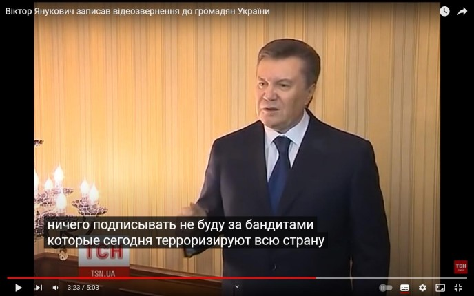
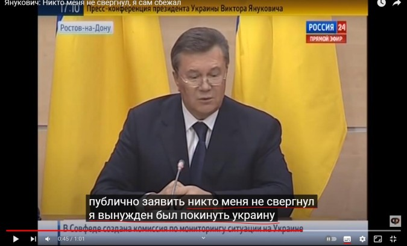
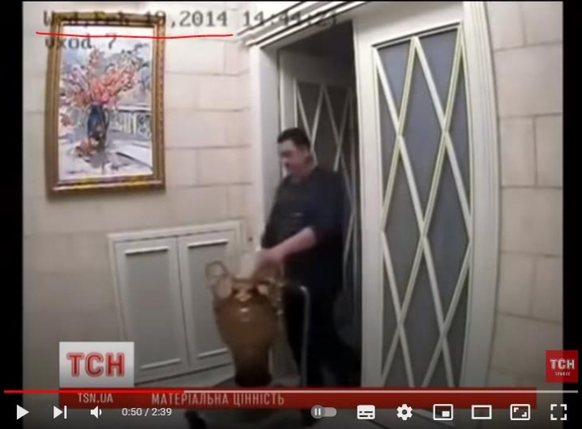
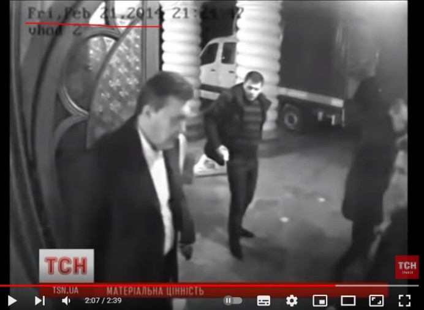
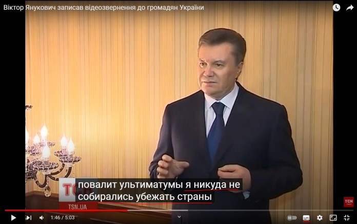

# 22 февраля 2014 года Окончание «Майдана»

## 1. Подписание соглашения с оппозицией

Соглашение об урегулировании политического кризиса в Украине – документ, подписанный 21
февраля 2014 года Президентом Украины Януковичем В.Ф. и лидерами парламентской оппозиции
(Виталий Кличко партия УДАР, Арсений Яценюк ВО «Батькивщина» и Олег Тягнибок ВО «Свобода»)
при посредничестве представителей Евросоюза.
Ключевые договорённости были следующие:
⎯ восстановление конституции Украины от 2004 года (был принят соответствующий Закон
«О возобновлении действия отдельных положений Конституции Украины» на заседании Верховной
Рады Украины 21 февраля 2014 года);
⎯ конституционная реформа, уравновешивающая полномочия Президента, правительства и
парламента;
⎯ назначение новых Президентских выборов до декабря 2014 года.
При публичном объявлении лидерами оппозиции условий подписанного Соглашения,
представители «Правого сектора» заявили, что их не устраивает оговорённая в документе постепенность
политических реформ, и потребовали немедленного ухода в отставку Президента Януковича В.Ф. – в
противном случае они были намерены пойти на штурм администрации Президента и Верховной Рады.
Лидер «Правого сектора» Дмитрий Ярош заявил, что в Соглашении отсутствуют чёткие обязательства
относительно отставки Президента, роспуска Верховной Рады, наказания руководителей силовых
ведомств и исполнителей «преступных приказов, в результате которых были убиты около сотни
украинских граждан», он назвал Соглашение «очередным замыливанием глаз» и отказался его
выполнять. Ярош пригрозил, что если до следующего утра Янукович не подаст в отставку, то «Правый
сектор» начнёт штурм администрации Президента.
Позже, в ночь с 21 на 22 февраля 2014 года Янукович В.Ф. улетел в Харьков, где в общении с
журналистами отказался от выполнения договорённостей и подписания документов, которые принесут
ему на подпись депутаты Верховной Рады Украины тем самым нарушив Конституцию Украины
(статья 106, пункт 29), что и привело к голосованию Верховной Рады о его самоустранении.

## 2. Увольнение судей Конституционного суда

Перед тем как говорить о самоустранении Януковича В.Ф., необходимо упомянуть тот факт, что
многие считают самоустранение незаконным в связи с увольнением судей и назначением на их место «нужных людей», которые принимали решение о конституционности данного постановления. Решение
об увольнении судей было принято не в последний момент перед признанием факта самоустранения
Януковича В.Ф. Впервые проект увольнения судей был подан на рассмотрение в Верховную Раду
Украины 3 февраля 2014 года, задолго до рассмотрения дела о самоустранении.
Также необходимо отметить, что согласно Конституции Украины (статья 85 пункт 26 и статья 148 )
Верховная Рада назначает 6 (треть) судей Конституционного суда Украины. Именно полномочия этих 6
судей и были досрочно прекращены за нарушение ими присяги (это одно из оснований, из-за которых
можно уволить судей согласно Конституции Украины статья 149^1 пункт 3).

#### 3. «Самоустранение»

22 февраля 2014 года Верховная Рада Украина выставила на голосование постановление о том, что
Янукович В.Ф. самоустранился от выполнения обязанностей Президента Украины неконституционным
способом, а также назначила новые выборы Президента Украины на 25 мая 2014 года согласно
Конституции Украины (статья 85 пункт 7).
Результаты голосования были следующие:

**Решение Количество голосов**

| Решение       | Количество голосов |
| ------------- | ------------------ |
| ЗА            | 328                |
| ПРОТИВ        | 0                  |
| ВОЗДЕРЖАЛИСЬ  | 0                  |
| НЕ ГОЛОСОВАЛИ | 6                  |
| ОТСУТСТВОВАЛИ | 116                |

Необходимо отметить, что партия Регионов, которую возглавлял Янукович В.Ф., проголосовала
следующим образом:

**Решение Количество голосов**

| Решение       | Количество голосов |
| ------------- | ------------------ |
| ЗА            | 36                 |
| ПРОТИВ        | 0                  |
| ВОЗДЕРЖАЛИСЬ  | 0                  |
| НЕ ГОЛОСОВАЛИ | 2                  |
| ОТСУТСТВОВАЛИ | 96                 |

Согласно прошедшему голосованию, решение о «самоустранении» Януковича В.Ф. и дате выборов
нового Президента Украины было принято 22 февраля 2014 года.
Важно обратить внимание, что сам Янукович В.Ф. сказал по поводу эту решения:

Своими действиями Верховная Рада Украина устранила правовую лакуну (см. термины) в
законодательстве Украины.
Причины для признания самоустранения были следующие:
⎯ отказ от выполнения соглашения с оппозицией (подписание документов от Верховной Рады);
⎯ регулярное и систематическое нарушение Конституции Украины;
⎯ отсутствие на рабочем месте и фактическое прекращение выполнения своих полномочий.
4 февраля 2015 года Верховная Рада Украины лишила соответствующим законом Януковича В.Ф.
звания Президента Украины.
Новоизбранным Президентом Украины Порошенко П.А. в Конституционный суд Украины было
направлено конституционное представление о том, является ли законным, с точки зрения Конституции
Украины, закон Верховной Рады Украины о лишении звания Президента Украины Януковича В.Ф.
В ответ на это представление Конституционный суд Украины принял:

1. Это не вопрос Конституционного Суда Украины;
2. Закрыть конституционное производство.
       В свою очередь со стороны Януковича В.Ф. не поступало апелляций в Конституционный суд
   Украины по поводу признания факта «самоустранения» незаконным.

#### 4. Отъезд Януковича В.Ф. из Украины

В данном разделе кратко восстановлена хронология и места, которые посетил Януковича В.Ф. во
время побега из территории Украины начиная с 19 февраля 2014 года (имеются видеозаписи с
подготовкой к побегу именно с этой датой).
На имеющихся видеозаписях сборов вещей в усадьбе «Межигорье», где проживал Янукович В.Ф.,
имеется дата записи. Согласно им, сборы начались не позже 19 февраля 2014 года.

На записи от 21 февраля 20 14 года видно, что Янукович В.Ф. лично контролирует погрузку вещей
с последующей их транспортировкой.

Это был последний раз, когда Янукович В.Ф. находился в своей резиденции на территории Киева.
После этого он улетел в Харьков. Там Янукович В.Ф. участвовал в общении с журналистами и говорил о
том, что не собирается покидать территорию Украины.

После этого он отправился в Донецк, где была совершена попытка вылететь на самолёте в
неизвестном направлении, однако пограничники его не выпустили в связи с отсутствием необходимых документов для вылета. После данного инцидента Янукович В.Ф. в ночь с 22 на 23 февраля отправился в
Запорожскую область. Недалеко от г. Бердянск его встретили российские военные на вертолётах, которые
доставили его в Анапу на территорию Российской Федерации. Оставаться там Янукович В.Ф. не
планировал и утром вылетел в г. Ялту. Из г. Ялты он отправился в г. Севастополь. Одновременно с этим,
в аэропорт города Бельбек (недалеко от Севастополя), из Киева прилетела делегация во главе с
Министром внутренних дел Украины Аваковым А.В. с целью ареста Януковича В.Ф. Янукович В.Ф.
узнал о готовящемся аресте и отправился в военную часть Российской Федерации. Оттуда он уже попал
на территорию Российской Федерации, где и находится на данный момент.
Во время следственных действий, связанных с обвинениями Януковича В.Ф., проводился допрос
сотрудника Управления госохраны Виктора Ризниченко. В своих показаниях он сообщил, что в феврале
2014 года на Януковича В.Ф. не совершалось никаких покушений, а также он подтвердил маршрут
движения Януковича В.Ф. во время отъезда из Украины. В своих показаниях Виктор Ризниченко говорил
о том, что в побеге Януковича В.Ф. из Украины принимала участие и Российская Федерация.
В интервью Президент России Путин В.В. подтвердил своё участие в побеге Януковича В.Ф. с
территории Украины в город Ростов на территории Российской Федерации.

>   Да, скажу откровенно, он \[Президент Украины Янукович В.Ф. прим. ред.] попросил
> вывезти его в Россию, что мы и сделали. Вот и всё. 
>
> *В.В. Путин* 

#### 5. Уголовные дела Януковича В.Ф.

После принятия постановления о самоустранении и побега Януковича В.Ф. из Украины в
Российскую Федерацию на него был заведён ряд уголовных дел.
